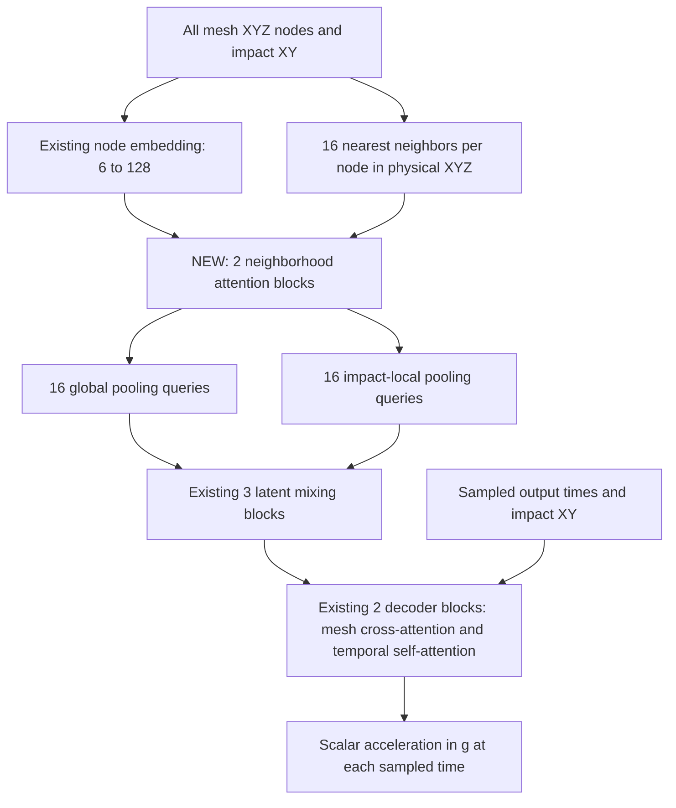

# Neighborhood attention and design-sensitivity training

This experiment adds **two local point-attention layers before mesh pooling**
and a **matched-location, cross-cluster response-difference loss**. It retains
the temporal decoder restored after the no-temporal ablation.

Branch: `agent/mesh-impact-neighborhood-attention`.
Reference run: `20260912_005426_3134539_1704`.

## Submit on DeltaAI

From the repository root:

```bash
git fetch origin
git switch agent/mesh-impact-neighborhood-attention
git pull --ff-only origin agent/mesh-impact-neighborhood-attention
bash -l setup_mesh_impact_history_env.sh
bash submit_mesh_impact_history_1704_local_sensitivity.sh
```

Setup uses the existing environment and checks the declared dependencies,
including SciPy for sparse neighbor lookup. The existing six-hour allocation
is enough: caching the structural neighbor graph keeps the added cost near
5% of baseline epoch time (see **Cost**), against the 36 minutes the
reference 100-epoch run took. W&B uses the existing login and project.

The new wrapper pins temporal attention, both new additions, the headform
holdout and the split:

| Split | Designs | Impacts |
|---|---|---:|
| Train | 0, 1, 2, 3, 4, 6, 7, 8, 9 | 1278 |
| Validation | 5 | 142 |
| Test | 10, 11, the entire D cluster | 284 |

Validation design 5 still shares cluster B with training design 4, exactly as
in the reference run. Neither test design participates in training, scaler
fitting, difference pairs or validation checkpoint selection. The batch script
keeps the working direct-Python launch inside the Slurm batch allocation.

## Network



The default new model has **1,530,137 trainable parameters**, versus 1,263,889
in the temporal baseline: 266,248 additional parameters (21.1%). Width 128,
four heads, 32 pooled tokens, three latent layers, two temporal decoder layers
and dropout 0.1 retain their baseline values. There is no separate HIC head;
the existing HIC evaluator can integrate these predicted acceleration histories.

### 1. Local feature extraction before pooling

Previously each node was embedded independently:

\[
h_i^{(0)}=\phi([\widetilde x_i,\widetilde y_i,\widetilde z_i,
\Delta\widetilde x_i,\Delta\widetilde y_i,
\Delta\widetilde x_i^2+\Delta\widetilde y_i^2])\in\mathbb R^{128}.
\]

The tilde denotes the existing train-only mesh scaling; impact XY is first
converted to that same coordinate frame. The node embedding remains unchanged.
Now each node exchanges information with its 16 nearest nodes in **physical
3D Euclidean distance**, including the zero-distance/self entry. With fewer
than 16 nodes, all available nodes are used. Neighbor selection undoes the
unequal XYZ standard deviations, so a millimeter in Z has the same geometric
meaning as a millimeter in X. Translation by the scaler mean cancels.

For head \(m\) in layer \(\ell\), let \(u_i=\operatorname{LN}(h_i^{(\ell)})\)
and \(q_i^m=W_q^m u_i\), \(k_j^m=W_k^m u_j\), \(v_j^m=W_v^m u_j\).
The head dimension is \(d_h=32\). Define

\[
r_{ij}=\frac{x_j-x_i}{20\ \mathrm{mm}},\qquad
e_{ij}^{m}=\frac{(q_i^m)^\top k_j^m}{\sqrt{32}}+b_m(r_{ij}),
\qquad
\alpha_{ij}^{m}=\operatorname{softmax}_{j\in\mathcal N(i)}e_{ij}^{m}.
\]

Here \(b\) is a learned `3 → 32 → heads` MLP. The 20 mm constant scales the
positional features; **it is not a neighborhood cutoff radius**. Messages also
contain a learned relative-position vector:

\[
m_i^m=\sum_{j\in\mathcal N(i)}\alpha_{ij}^m
\left(v_j^m+P_m r_{ij}\right),\qquad
z_i=h_i^{(\ell)}+W_o\operatorname{concat}_m(m_i^m),
\]
\[
h_i^{(\ell+1)}=z_i+\operatorname{FFN}(\operatorname{LN}(z_i)).
\]

The FFN has widths `128 → 256 → 128`. Training dropout is applied to attention
weights, residual updates and the FFN; omitted above for readability. Two
layers allow information to travel along two neighbor hops before compression.
Relative direction and height enter both attention scores and messages, giving
the encoder a way to learn local geometric relationships that an independent
node MLP cannot directly represent.

Every node, including those far from impact, is updated. The resulting features
feed the existing all-node global/local pooling. This is local point attention
inspired by [Point Transformer](https://openaccess.thecvf.com/content/ICCV2021/html/Zhao_Point_Transformer_ICCV_2021_paper.html),
using scalar weights per head rather than reproducing that paper's full vector
attention architecture.

Neighbor lookup uses a [SciPy cKDTree](https://docs.scipy.org/doc/scipy/reference/generated/scipy.spatial.cKDTree.query.html)
on each mesh, with canonical coordinate order for tie handling. The graph is
reused by both layers within that forward pass. It does not depend on response
labels or other designs. Selection is discrete; gradients pass through the
selected nodes' features and relative coordinates. Attention work scales with
\(NK\), with \(K=16\), instead of \(N^2\). Chunks of 1024 center nodes and
activation recomputation bound edge memory during training.

This remains a point-cloud geometry model: proximity does **not** establish
shell connectivity, weld attachment or contact. No panel, material, thickness
or boundary-condition attributes have been added.

#### The headform is held out of the local graph

Each 1704 `*NODE` block begins with the 286 rigid headform nodes, and those
are the only nodes that move between impacts on one design: comparing runs 1
and 2 shows exactly indices 0-285 displaced, by up to 1400 mm, with every
remaining node identical. `--impactor-nodes 286` keeps that block out of the
local graph. Two reasons:

- The headform is a rigid impactor, not hood structure. Its position is
  already stated exactly by `indentor`, so letting it crowd the 16 neighbor
  slots of nearby panel nodes spends local capacity re-deriving a known input.
- With it excluded, the structural graph is identical for all 142 impacts on a
  design, so it is built once and reused instead of rebuilt per run.

Held-out nodes still reach the pooled memory with their embedding intact; only
local attention skips them. Preflight verifies the boundary against runs 1 and
2 before training, so a wrong count fails immediately rather than silently
holding out panel nodes. `--impactor-nodes 0` restores the old behavior and
warns that the graph will be rebuilt for every run.

#### Cost

Measured on the real meshes (38,977 nodes for designs 0-5, 40,057 for 6-11)
against the 21.8 s/epoch of the reference run `20260912_005426`:

| | added per epoch | epoch total | vs baseline |
|---|---:|---:|---:|
| Rebuild per run | 299.6 s | 321.4 s | 14.7x |
| Cached per design | 1.0 s | 22.8 s | **1.05x** |

A graph costs about 115 ms to build and 0.73 ms to look up, so the nine
training designs cost roughly one second once. Memory is not the constraint:
full attention would need a 24.3 GB score tensor per mesh, while k=16 needs
10 MB, and chunking with activation recomputation holds the live edge tensors
to about 8 MB.

### 2. Learning design sensitivity

Let \(a_{d,p,t}\) be the true acceleration for design \(d\), impact location
\(p\), and sampled time \(t\). Define normalized targets and predictions using
the same training-only acceleration mean \(\mu_a\) and standard deviation
\(\sigma_a\):

\[
y_{d,p,t}=\frac{a_{d,p,t}-\mu_a}{\sigma_a},\qquad
\widehat y_{d,p,t}=f_\theta(X_{d,p},p,t).
\]

The ordinary acceleration loss remains:

\[
\mathcal L_{\mathrm{acc}}=\frac1{\sum_b T_b}
\sum_{b,t}(\widehat y_{b,t}-y_{b,t})^2.
\]

For pairs \(\mathcal P_B\) within a training batch with **the same impact
location and different geometry clusters**, add

\[
\mathcal L_{\mathrm{diff}}=\frac1{|\mathcal P_B|}
\sum_{(d,e,p)\in\mathcal P_B}\frac1{T_p}\sum_t
\left[(\widehat y_{d,p,t}-\widehat y_{e,p,t})
-(y_{d,p,t}-y_{e,p,t})\right]^2,
\]
\[
\boxed{\mathcal L=\mathcal L_{\mathrm{acc}}+\lambda\mathcal L_{\mathrm{diff}},
\qquad\lambda=1.0.}
\]

A batch with no eligible pairs has zero difference loss and still trains on
ordinary acceleration MSE. Both terms use the global training acceleration
scale; the loss never divides by a small per-pair difference or forces designs
to differ when their true responses agree.

For example, if the truth is 100 g versus 120 g at a particular location/time,
predicting 110 g for both designs has zero predicted difference but a true
difference of -20 g. The extra penalty is \((20/\sigma_a)^2\). Predicting
110 g and 130 g gets the difference right; ordinary MSE still penalizes the
shared +10 g error.

Equivalently, for an isolated equally weighted pair, write prediction errors
as \(e_d=c+q\), \(e_e=c-q\). Then
\(\mathcal L_{\mathrm{acc}}=c^2+q^2\) and
\(\mathcal L=c^2+(1+4\lambda)q^2\). At \(\lambda=1\), this gives five times
the weight to the differential error in that simple case while retaining the
penalty on common error. It is an explicit supervised preference for matching
design sensitivity, not proof that generalization will improve.

The training loader groups examples by `(run_number - 1) % 142`, verifies raw
XY equality within 0.001 mm and exactly matching sampled time grids, and pairs
different clusters among the already-split training examples. At each location,
it repeatedly pairs the two largest remaining cluster pools, with randomized
tie-breaking and partners. It shuffles these pairs and keeps them together in
even-sized batches. All leftover examples are included afterward.

For this split, each location has four A designs, one B design and four C
designs: four pairs plus one leftover. All 1278 training runs appear exactly
once per epoch, in 160 batches at batch size 8. The loss uses every eligible
pair present in a batch, so accidental additional matches are included too.
Pairing varies reproducibly with `seed + epoch`. A/B/C labels only construct
the training objective; **design IDs and cluster IDs are not network inputs**.

AdamW, learning rate 0.0003, weight decay 0.00001, cosine scheduling, gradient
clipping at 1, seed 42, 100 epochs and the existing time stride 16 retain their
default values. Initialization is from scratch. As before, the saved checkpoint
minimizes **validation acceleration MSE**, with no difference loss on validation
or test. Optional existing environment overrides still apply to these ordinary
training settings.

## Artifacts and independent ablations

`config.json` records all neighborhood parameters, the difference-loss weight
and matched sampling. `training_history.json` and CSV record the total training
objective, ordinary acceleration MSE, difference MSE and number of pairs each
epoch. W&B receives these separately. The loss plot compares ordinary training
and validation acceleration MSE; it does not label the combined objective as
acceleration MSE. Epoch objective is averaged over optimization steps, ordinary
MSE over time points, and difference MSE over pairs.

The same checkpoint and `HistoryPredictor` interface work with the existing
acceleration and HIC evaluation tools. Old configs omit the new parameters and
strictly reload the baseline architecture.

To test each contribution separately, use the generic cluster-D wrapper:

```bash
# Neighborhood encoder only
HOOD_MESH_DECODER=temporal HOOD_MESH_NEIGHBORHOOD_LAYERS=2 \
HOOD_MESH_DESIGN_DIFFERENCE_WEIGHT=0 \
bash submit_mesh_impact_history_1704_clusterD.sh

# Design-sensitivity training only
HOOD_MESH_DECODER=temporal HOOD_MESH_NEIGHBORHOOD_LAYERS=0 \
HOOD_MESH_DESIGN_DIFFERENCE_WEIGHT=1 \
bash submit_mesh_impact_history_1704_clusterD.sh
```

Python defaults are zero neighborhood layers and zero difference weight,
preserving the temporal baseline. The dedicated new wrapper pins two layers
and weight 1; use that wrapper for the combined experiment.

## Verification

Tests exercise physical neighbor selection, permutation invariance, local
influence, mesh isolation, chunked gradient equivalence, mixed precision,
the headform holdout and its cache (structural rows unaffected by headform
movement, held-out rows passed through, one build per geometry, nothing added
to the state dict), the preflight boundary check,
matched sampling without dropped/duplicated runs, pair alignment checks and
the loss's signed gradients. A two-epoch integration run executes both changes,
checks train-only scalers, exports test histories and reproduces them after
strict checkpoint reload. Submission tests execute the real shell scripts with
Slurm stand-ins, including the previously failing `srun` scenario.

A local CUDA smoke test using eight actual approximately 39,000-node meshes
completed two optimization steps at full default model width, with finite
losses and about 5.13 GiB peak allocated GPU memory. This checks executability,
not convergence or DeltaAI runtime. The completed 100-epoch cluster-D run is
needed to measure acceleration and HIC prediction performance.

The actual 1278 training histories also passed the coordinate/time alignment
audit: 142 matched locations, 160 batches and 575 eligible pairs in epoch 1
with seed 42 (568 deliberately arranged pairs plus seven additional matches).
