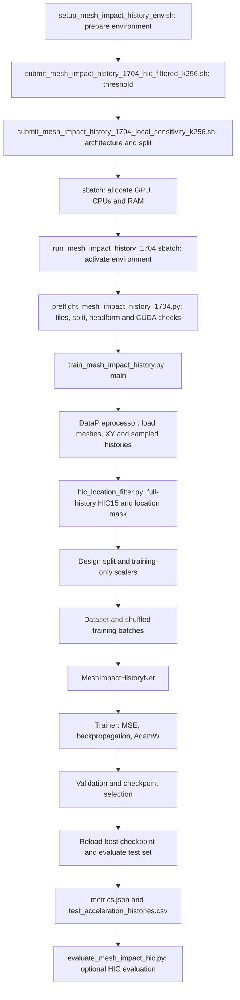

# Mesh acceleration pipeline: from submission to predictions

This is the current neighborhood-attention experiment: two neighborhood layers,
256 nearest structural nodes, a temporal decoder, and **ordinary acceleration
MSE only**. The HIC threshold selects examples; it is not a loss term.

## Execution map



## 1. Environment and submission

The shell files have separate responsibilities:

| File | Responsibility |
|---|---|
| [setup_mesh_impact_history_env.sh](setup_mesh_impact_history_env.sh) | Load DeltaAI's CUDA PyTorch module, create a venv overlay, install dependencies, check imports |
| [submit_mesh_impact_history_1704_hic_filtered_k256.sh](submit_mesh_impact_history_1704_hic_filtered_k256.sh) | Set default HIC threshold to 10%, set run name, call the k256 launcher |
| [submit_mesh_impact_history_1704_local_sensitivity_k256.sh](submit_mesh_impact_history_1704_local_sensitivity_k256.sh) | Pin two neighborhood layers, k=256, temporal decoder, headform exclusion and split; call sbatch |
| [run_mesh_impact_history_1704.sbatch](run_mesh_impact_history_1704.sbatch) | Activate the environment, run preflight, construct Python arguments, start training |

The setup script installs `requirements_mesh_impact_history.txt`. The local
walkthrough uses the already-installed `.venv`.

On DeltaAI, with an environment already prepared and the current code synced:

```bash
bash submit_mesh_impact_history_1704_hic_filtered_k256.sh
# Or choose another threshold:
HOOD_MESH_HIC_RANGE_THRESHOLD_PERCENT=20 bash submit_mesh_impact_history_1704_hic_filtered_k256.sh
```

The k256 launcher requests **one GPU and 24 hours**. The shared batch script
requests one node, one task, 16 CPU cores and 96 GB RAM, on partition `ghx4`
with account `bbqg-dtai-gh`. Its own time default is six hours; the launcher
overrides it to 24 hours. These are the values in the code, not a live check of
cluster availability. W&B defaults to online. No cluster job is submitted by
the local demonstration.

The batch script prints the exact Python command, dataset path, output path,
commit and GPU allocation. It launches Python directly within the batch job.
Environment overrides are converted to command-line arguments; for example,
`HOOD_MESH_HIC_RANGE_THRESHOLD_PERCENT` becomes `--hic-range-threshold-percent`.
The saved run's `config.json` is the final record of resolved settings.

## 2. Preflight

[preflight_mesh_impact_history_1704.py](preflight_mesh_impact_history_1704.py)
checks the 1704-file dataset layout, impact coordinates, held-out geometry
clusters, the leading 286 headform nodes, and the execution environment.
With `--require-cuda`, it also exercises a model forward/backward pass on CUDA.
The production batch script stops if preflight fails.

Preflight audits the full dataset. HIC filtering happens inside training after
loading, so preflight's split counts precede filtering.

## 3. Raw simulation inputs and preprocessing

The data root defaults to `Data/HoodImpact_1704_EuroNCAP/`:

| Input | What is read |
|---|---|
| `inp_files/HoodImpact_<run>.inp` | The first Abaqus `*NODE` block: XYZ coordinates |
| `ImpactCoords_1704.csv` | Row `run - 1`, columns `X1`, `X2` |
| `output_history_acc/HoodImpact_<run>_SAE1000_interp1000.csv` | `Time` in seconds and `A(in g)` |

[utils/utils.py](utils/utils.py), class `DataPreprocessor`, performs this work.
`load_all_data()` calls `load_mesh_geometry()` and `load_acceleration_history()`.
The latter applies an optional time cutoff, then takes every 16th sample by
default. For a 1000-point history, this gives 63 prediction times.

It returns aligned collections: `run_numbers`, `mesh_geometries`,
`indentor_positions`, `time_arrays`, and `accelerations`. The training entry
point validates their dimensions, finite values and increasing times.

The code consumes already-postprocessed simulation CSVs. It does not launch
Abaqus or perform SAE filtering of raw solver signals during neural training.

## 4. HIC-based location selection

[hic_location_filter.py](hic_location_filter.py) independently reads all 1704
full-resolution supplied histories. [hic15.py](hic15.py) searches every
admissible trapezoidal integration interval up to 15 ms. This calculation is
before the training time stride and cutoff.

At each of 142 locations, compute:

`variation_percent = 100 * (maximum HIC15 - minimum HIC15) / mean HIC15`

The maximum, minimum and mean use all 12 designs. Keep a location when its
variation is greater than or equal to the threshold. Apply that same location
mask to every design and every split. Original run numbers remain intact.

At 10%, 109 locations pass. Full-data training requires all 1704 source runs to
load, and fails on an empty selection. All-design selection includes held-out
labels; test performance therefore describes this selected subset.

## 5. Split and normalize

`resolve_splits()` in [train_mesh_impact_history.py](train_mesh_impact_history.py)
and `create_data_loaders()` in [utils/utils.py](utils/utils.py) use:

```python
design_id = (run_number - 1) // 142
location_id = (run_number - 1) % 142 + 1
```

| Split | Designs | Histories at 10% |
|---|---|---:|
| Train | 0, 1, 2, 3, 6, 7, 8, 9, 10 | 981 |
| Validation | 11 | 109 |
| Test | 4, 5 | 218 |

The entry point fits mesh XYZ, impact XY, time, and acceleration StandardScalers
on retained training examples only. Dataset `__getitem__()` applies those
scalers. Validation and test reuse the same statistics.

`collate_fn()` concatenates variable-size meshes and histories. `mesh_batch`
and `time_batch` identify which example each node or time belongs to. The model
never exchanges attention between different examples. Training shuffles
examples; validation and test do not. There is no matched-pair sampler.

## 6. Network forward pass

Definitions: [mesh_impact_history.py](mesh_impact_history.py),
[mesh_neighborhood.py](mesh_neighborhood.py).

| Stage | Shape for one example | Operation |
|---|---|---|
| Raw mesh | N x 3 | Standardized XYZ |
| Node features | N x 6 | XYZ, impact-relative XY, squared relative XY distance |
| Embedding | N x 128 | Linear 6->128->128, GELU, LayerNorm |
| Two neighborhood blocks | (N-286) x 128 | 256 nearest structural neighbors, four attention heads, relative XYZ scores/messages |
| Reattach headform embeddings | N x 128 | Leading 286 nodes bypass local updates |
| Attention pooling | 256 x 128 | 128 global queries + 128 queries with learned radial impact bias |
| Three latent blocks | 256 x 128 | Self-attention among pooled mesh tokens |
| Time queries | T x 128 | Five continuous time features embedded and conditioned on impact XY |
| Two decoder blocks | T x 128 | Cross-attend to mesh memory, then self-attend across requested times |
| Acceleration head | T x 1 | LayerNorm, linear 128->128->1 with GELU |

Default model size: **1,558,921 trainable parameters**. Width 128, four heads,
dropout 0.1. Local feedforward width is 256; latent and decoder feedforward
width is 512. Neighbor graphs use physical XYZ, with relative positions scaled
by 20 mm. Both local layers reuse the same graph. Node chunks of 1024 and
activation recomputation limit memory use. The graph is cached per geometry.

The 256 neighbors and 256 pooled tokens are independent settings. The full
production network keeps all structural nodes. The demo reduces their count.

## 7. Training and model selection

[utils/utils.py](utils/utils.py), class `Trainer`, performs the optimization:

```python
optimizer.zero_grad()
prediction = model(mesh, mesh_batch, impact_xy, times, time_batch, batch_size)
loss = criterion(prediction, normalized_acceleration)  # nn.MSELoss()
loss.backward()
torch.nn.utils.clip_grad_norm_(model.parameters(), max_norm=1.0)
optimizer.step()
```

Defaults: AdamW, learning rate 0.0003, weight decay 0.00001, 100 epochs,
batch size 8, cosine learning-rate scheduling, seed 42. No difference loss or
HIC loss is computed. At 981 training examples there are 123 batches per epoch.

Each epoch trains, validates without gradients, updates the schedule, and saves
checkpoints. The best checkpoint minimizes validation normalized acceleration
MSE. The latest checkpoint supports continuation. Test data does not select
the best epoch. The logged training epoch loss averages batch MSE values.

## 8. Evaluation, artifacts and inference

The entry point reloads the best checkpoint, evaluates test examples, converts
predictions back to g, and writes:

| Artifact | Purpose |
|---|---|
| `config.json` | Architecture, training settings, paths and location filter |
| `splits.json` | Original run IDs in each retained split |
| `scalers.joblib` | Training-only normalization statistics |
| `prediction_times.npy` | Sampled time grid in physical units |
| `hic_location_filter.json`, `hic_location_variation.csv` | Selection and per-location evidence, for filtered production runs |
| `hood_impact_best_model.pt` | Best validation checkpoint |
| `hood_impact_last_model.pt` | Latest complete training state |
| `training_history.json`, `.csv`, `.png` | Epoch losses and plot |
| `metrics.json` | Test acceleration MSE, RMSE, MAE and R-squared |
| `test_acceleration_histories.csv` | Run number, time, true acceleration and predicted acceleration |
| `training.log` | Execution log |

Optional HIC evaluation is a separate command, not part of the training loss:

```bash
python evaluate_mesh_impact_hic.py runs/mesh_impact_history/YOUR_RUN --no-history-plots
```

`HistoryPredictor.from_run()` reloads the model, scalers and time grid.
`predict(mesh_xyz, impact_xy)` accepts physical coordinates and returns
acceleration in g. No true acceleration is needed at inference.

## 9. Watch it execute locally

[demo_mesh_history_pipeline.py](demo_mesh_history_pipeline.py) recomputes the
full-data HIC mask, then selects the first qualifying location across all 12
designs. It retains 512 structural nodes plus all 286 headform nodes per mesh.
It temporarily substitutes this reduced-data loader and adds forward hooks,
then calls the real training `main()` with the full default network, k=256,
two epochs, batch size 3, CPU, and W&B disabled.

```powershell
.\.venv\Scripts\python.exe -u demo_mesh_history_pipeline.py
```

On Linux with dependencies active:

```bash
python -u demo_mesh_history_pipeline.py
```

The program prints first-forward tensor shapes and runs six optimization steps,
validation, checkpoint selection and test export. It then uses the public
inference API to verify that strict checkpoint reload reproduces the exported
predictions. The output directory contains `demonstration.json`, the full-data
HIC report, and a `training/` directory with ordinary run artifacts.

**This is a reduced-data execution demonstration, not an accuracy result.** Its
split is 9/1/2 histories; mesh thinning changes the physical neighborhoods. The
production launcher uses all retained locations, full meshes, batch size 8 and
100 epochs. The demo performs HIC selection outside the entry point because
the production filter correctly requires the complete 1704-run dataset.

## Observed local demonstration

The run in `runs/pipeline_demo/walkthrough/` completed successfully using
location 4 and the settings described above:

| Epoch | Training normalized MSE | Validation normalized MSE |
|---|---:|---:|
| 1 | 1.016462 | 1.070817 |
| 2 | 0.859672 | 0.903090 |

See [shape trace and reload check](runs/pipeline_demo/walkthrough/demonstration.json),
[loss plot](runs/pipeline_demo/walkthrough/training/training_history.png),
[resolved configuration](runs/pipeline_demo/walkthrough/training/config.json),
and [test histories](runs/pipeline_demo/walkthrough/training/test_acceleration_histories.csv).
The demonstration completed and checkpoint reproduction passed. W&B emitted
Windows temporary-directory cleanup warnings at interpreter exit afterward.
